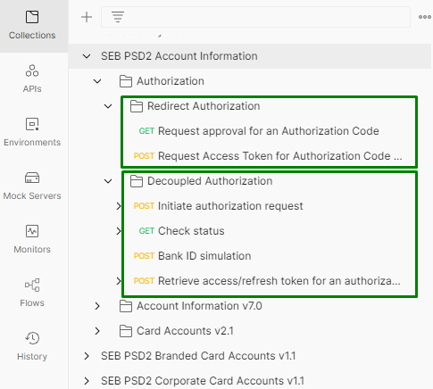
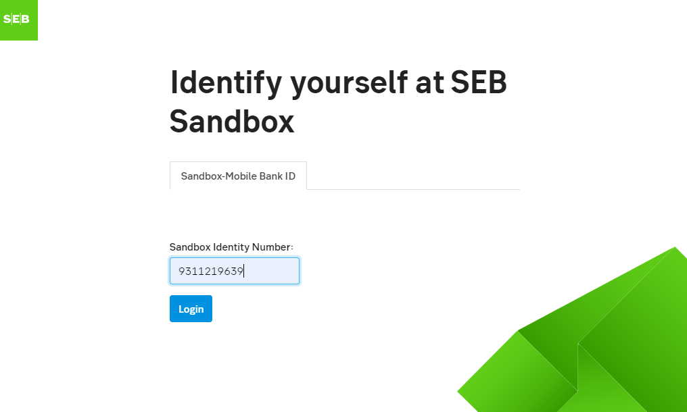
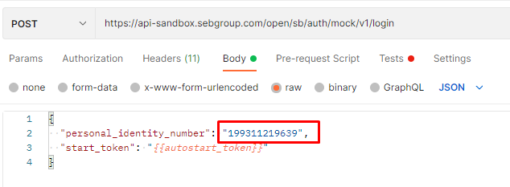

# SEB PSD2 postman collection
Get started using SEBs PSD2 products with postman collection. Mocked data is available through sandbox apps. Real data is available through production apps.

Read [SEB Developer Portal](https://developer.sebgroup.com) for more information.

### Prerequisite
You need to have your own sandbox credentials to test this collection against our sandbox. Go to [SEB Developer Portal Apps](https://developer.sebgroup.com/apps) to retrieve client ID & client secret.  

## How to use SEB PSD2 postman collection

### Step 1. Importing Collection into postman
1. Open postman
1. Select Import in the left navigation menu.
1. Select the files you want to import and select Import. We have 4 collections.
 * SEB PSD2 Account Information
 * SEB PSD2 Payment Initiation
 * SEB PSD2 Branded Card Accounts
 * SEB PSD2 Corporate Card Accounts 
 
### Step 2. Importing Environment into postman
1. Click on the Environments tab on the left navbar of postman
1. Click on the Import button
1. Click on the Upload Files button and select 'SEB PSD2 Sandbox.postman_environment.json' file
1. Click on the Import Button
 
### Step 3. Set your own Environment  
1. Click on the Environments tab on the left navbar of postman
2. Select 'SEB PSD2 Sandbox'
3. Add your own variables for below, leave others empty. You will find below values when you create sandbox App from developer portal.  

* clientId
* clientSecret
* redirectUri (should be same one used to create a sandbox app)

4. click [Save]
5. In the top right corner of postman, click the environment selector and select 'SEB PSD2 Sandbox'


###  Step 4. Test PSD2 APIs with sandbox
1. Authorization

   Each collection includes 2 authorizations, you can choose Redirect or Decoupled authorization for your needs. Refer the steps below for instruction. 
   
2. You are ready to call the API with your access token.


## Authorization
The Authorization APIs provide for an authorization & authentication mechanism for SEBs APIs. These APIs are used to obtain security tokens for protected APIs. We offer the redirect and decoupled authorization and you can test both from our sandbox.
Read [PSD2 Authorization](https://developer.sebgroup.com/products/authorization) for more information.



## Redirect Authorization 

### Step 1. [GET] Request approval for an Authorization Code
Obtaining the authorization code is an interactive process, which requires you to log in as a user. **It requires you to execute the request in the browser**   

> Tip! you could find url to use by clicking [Send] button from the endpoint '[GET] Request approval for an Authorization Code' then open the console window in the bottom of your postman to find url as below image.


:
    


Copy the **authorization code** in your browser as below.


### Step 3. [POST] Request access token for Authorization Code

Add copied **authorization code** to request body as below and click [Send].
* no need to change other variables since they are loaded from your environment variables.


### Step 4. Use the access token to access an API
    
[Redirect Authorization step by step guide](https://developer.sebgroup.com/products/authorization/redirect-authorization) 

## Decoupled Authorization 

### Step 1. [POST] Initiate authorization request  
 * no need to change any values since your *{{clientId}}* will be loaded from environment variables. This step returns an authorization registration id. 
  ``` 
    {
      "client_id": "{{clientId}}",
      "lang": "en",
      "scope": "{{scope}}",
      "start_mode": "ast"
    }
  ``` 
### Step 2. [GET] Check status  
 * no need to change any values since *{{auth_req_id}}* will be loaded from previous request. You will see response with status "Pending". 
 * expected response
  ``` 
    {
        "status": "PENDING",
        "hint_code": "OUTSTANDING_TRANSACTION",
        "autostart_token": "e0aa878a-cabc-4f3b-b805-0f988ea88b72",
        "poll_delay": 500
    }   
  ``` 
### Step 3. [POST] Bank ID simulation for sandbox  
Change **12 digits** Sandbox Identity Number (or default value can be used). you can find a list of available identity numbers from [SEB Developer Portal](https://developer.sebgroup.com/products/authorization/decoupled-authorization).

* no need to add *{{autostart_token}}* since it will be loaded from previous request. 
* Response code 204 No Content for successful login.


 
### Step 4. [GET] Check status [Send] again to see status
  ** expected response
  ``` 
    {
        "status": "COMPLETE",
        "poll_delay": 500
    }
  ``` 
### Step 5. [POST] Retrieve access token 
 * no need to change any values 
 
### Step 6. Use the access token as bearer token


Read more [Decoupled Authorization step by step guide](https://developer.sebgroup.com/products/authorization/decoupled-authorization) 

# Let's Rock!
:+1: Now you are ready to test SEB PSD2 APIs with your access token.


